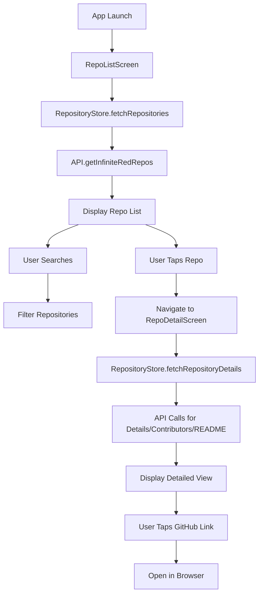

# Infinite Red Github Repo app

This app was generated using the Ignite boilerplate for React Native. It currently only contains the sample code that Ignite generates automatically. We'd like to turn this into an app that displays data about the public repos in Infinite Red's Github organization (https://github.com/infinitered)

## App Spec

The app should work like this:
  * Home screen
    * this should be a list of all of the public repos for Infinite Red
    * each list item should show the repo name and the number of stars
    * there should be a text box at the top of screen that allows the user to filter the list
    * note: you'll need to change the routing so that our home screen is the app home screen, and you should remove the authentication flow
  * Details screen: clicking on an item in the home screen should take the user to a details screen. This screen should show:
    * the repo name
    * the repo description
    * the number of stars
    * the number of forks
    * a preview of the README
    * a list of contributors (truncated if it's long)
    * a link that opens the Github page in a browser

## Phase 1 : Understand the Ignite stack

Look at the code provided by Ignite so you can make use of what's here as much as possible. For example, Ignite ships with Mobx State Tree, so let's use that for state management, rather than e.g. Redux

### Phase 1 Research Results

**Core Technologies & Libraries:**
- React Native 0.76.9 with Expo 52
- TypeScript for type safety
- Expo Dev Client for development

**State Management:**
- MobX State Tree (MST) for state management
- Current stores: `AuthenticationStore` and `EpisodeStore`
- Root store pattern with centralized state management

**Navigation:**
- React Navigation v7 with Native Stack Navigator
- Current flow: Login → Welcome → Demo screens
- Authentication-based conditional routing

**UI & Styling:**
- Custom theming system with light/dark mode support
- Comprehensive component library including:
  - Screen, Header, Button, Card, TextField, Icon
  - AutoImage, EmptyState, ListItem components
  - Toggle components (Switch, Checkbox, Radio)
- Typography and spacing systems
- Reanimated for animations

**API & Data:**
- Apisauce for HTTP requests (built on Axios)
- Current API setup for podcast episodes
- MMKV for local storage
- Date-fns for date formatting

**Development Tools:**
- Reactotron for debugging
- ESLint + Prettier for code quality
- Jest for testing
- Maestro for E2E testing

**Current App Structure:**
- Authentication Flow: App starts with Login screen if not authenticated
- Redirects to Welcome screen after authentication
- Demo navigator contains sample screens

**Key Architecture Patterns:**
- Observer pattern with MobX for reactive updates
- Centralized theming with context providers
- Modular component architecture
- Service layer for API interactions
- Internationalization (i18n) support

**What We Can Leverage for GitHub Repos App:**
1. **Navigation structure** - modify the existing stack navigator
2. **MobX State Tree** - create new stores for GitHub data
3. **API service pattern** - extend for GitHub API calls
4. **Existing components** - Screen, Header, ListItem, TextField for filtering
5. **Theming system** - consistent styling across the app

The foundation is solid and well-structured for building the GitHub repository browser app. The existing patterns and components will significantly speed up development.

## Phase 2 : Make a development plan

Review the spec and the Ignite details from Phase 1 and develop a plan to implement the app.

### Phase 2 Development Plan

Based on the analysis of the Ignite boilerplate and the app specification, here's a comprehensive plan to transform this into a GitHub repository browser for Infinite Red's organization.

#### Overview
We'll leverage the existing Ignite architecture (MobX State Tree, React Navigation, component library) while replacing the authentication flow with a direct home screen showing GitHub repositories.

#### Implementation Plan

##### 1. **Navigation & Routing Changes**
- **Remove authentication flow**: Modify `AppNavigator.tsx` to skip login and go directly to the repos list
- **Add new screens**:
  - `RepoListScreen` (Home screen with filterable repo list)
  - `RepoDetailScreen` (Detailed view of selected repository)
- **Update navigation types**: Add new screen types to `AppStackParamList`

##### 2. **State Management (MobX State Tree)**
- **Create Repository Model** (`app/models/Repository.ts`):
  - Properties: name, description, stars, forks, url, contributors, readme
  - Computed values for formatted data
- **Create RepositoryStore** (`app/models/RepositoryStore.ts`):
  - Actions: `fetchRepositories()`, `fetchRepositoryDetails()`, `setSearchFilter()`
  - Views: `filteredRepositories` (based on search term)
  - State: repositories array, loading states, search filter
- **Update RootStore**: Add the new RepositoryStore

##### 3. **API Integration**
- **Extend API service** (`app/services/api/api.ts`):
  - `getInfiniteRedRepos()`: Fetch public repos from GitHub API
  - `getRepositoryDetails()`: Get detailed repo info including README
  - `getRepositoryContributors()`: Fetch contributor list
- **GitHub API endpoints**:
  - `https://api.github.com/orgs/infinitered/repos`
  - `https://api.github.com/repos/infinitered/{repo}/readme`
  - `https://api.github.com/repos/infinitered/{repo}/contributors`

##### 4. **Screen Implementation**

###### **RepoListScreen (Home Screen)**
- **Layout**: Use existing `Screen`, `Header`, `ListView` components
- **Features**:
  - Search/filter TextField at the top
  - List of repositories using `ListItem` or `Card` components
  - Each item shows: repo name, star count, brief description
  - Pull-to-refresh functionality
  - Loading states with `ActivityIndicator`
  - Empty state handling
- **Navigation**: Tap item → navigate to RepoDetailScreen

###### **RepoDetailScreen**
- **Layout**: Scrollable screen with sections
- **Content sections**:
  - Header with repo name and description
  - Stats row (stars, forks)
  - README preview (truncated with "Read more" option)
  - Contributors list (horizontal scroll or grid)
  - "View on GitHub" button (opens in browser)
- **Components**: Leverage `Card`, `Button`, `Text`, `Icon` from existing library

##### 5. **Component Enhancements**
- **Extend existing components** rather than creating new ones:
  - Use `ListItem` for repo list items
  - Use `Card` for detail screen sections
  - Use `Button` for "View on GitHub" action
  - Use `TextField` for search functionality
- **Custom components** (if needed):
  - `StarRating` component for displaying star counts with icons
  - `ContributorAvatar` for contributor images

##### 6. **Data Flow Architecture**

##### 7. **Implementation Order**
1. **Models & Store Setup**
   - Create Repository model
   - Create RepositoryStore
   - Update RootStore
2. **API Integration**
   - Add GitHub API methods
   - Test API responses
3. **Navigation Updates**
   - Remove auth flow
   - Add new screens to navigator
4. **RepoListScreen Implementation**
   - Basic list view
   - Add search functionality
   - Implement navigation to details
5. **RepoDetailScreen Implementation**
   - Layout all sections
   - Implement GitHub link opening
6. **Polish & Testing**
   - Error handling
   - Loading states
   - Empty states

##### 8. **Key Technical Decisions**
- **Reuse existing patterns**: Follow the EpisodeStore pattern for RepositoryStore
- **Leverage existing components**: Maximize use of Ignite's component library
- **GitHub API**: Use public API (no authentication needed for public repos)
- **Navigation**: Replace auth flow with direct navigation to repo list
- **State management**: Follow MST patterns established in the codebase

##### 9. **Files to Create/Modify**
**New Files:**
- `app/models/Repository.ts`
- `app/models/RepositoryStore.ts`
- `app/screens/RepoListScreen.tsx`
- `app/screens/RepoDetailScreen.tsx`

**Modified Files:**
- `app/navigators/AppNavigator.tsx`
- `app/models/RootStore.ts`
- `app/services/api/api.ts`
- `app/services/api/api.types.ts`
- `app/screens/index.ts`

This plan leverages the existing Ignite architecture while implementing the GitHub repository browser functionality. The approach minimizes custom code by reusing established patterns and components.
